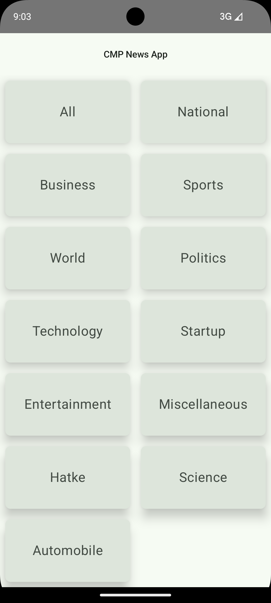
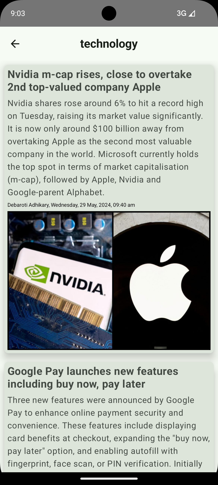
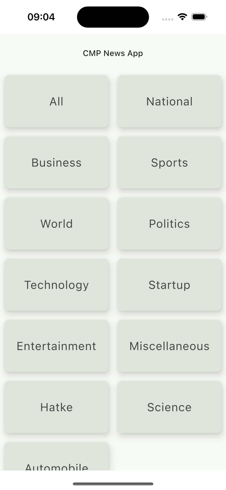
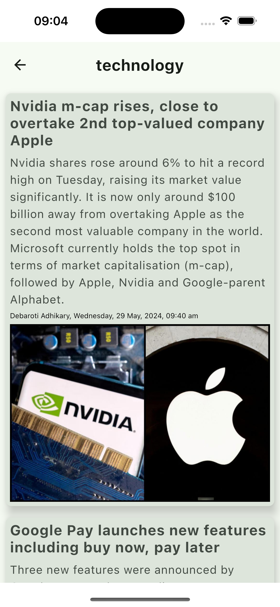
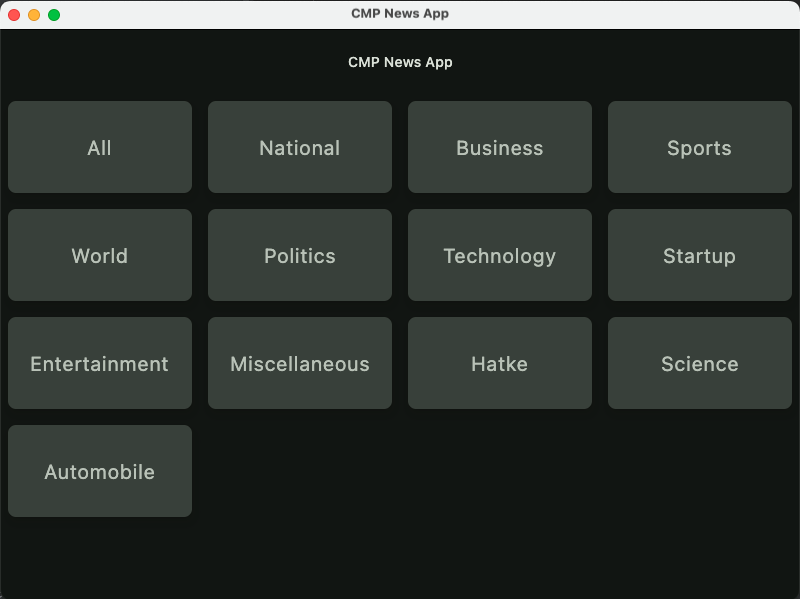
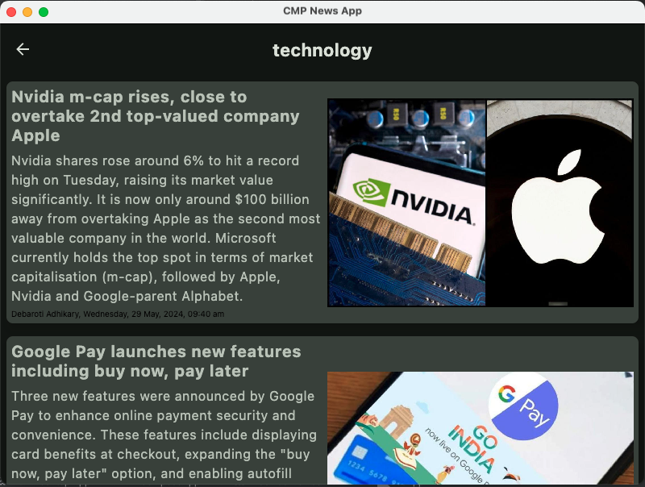
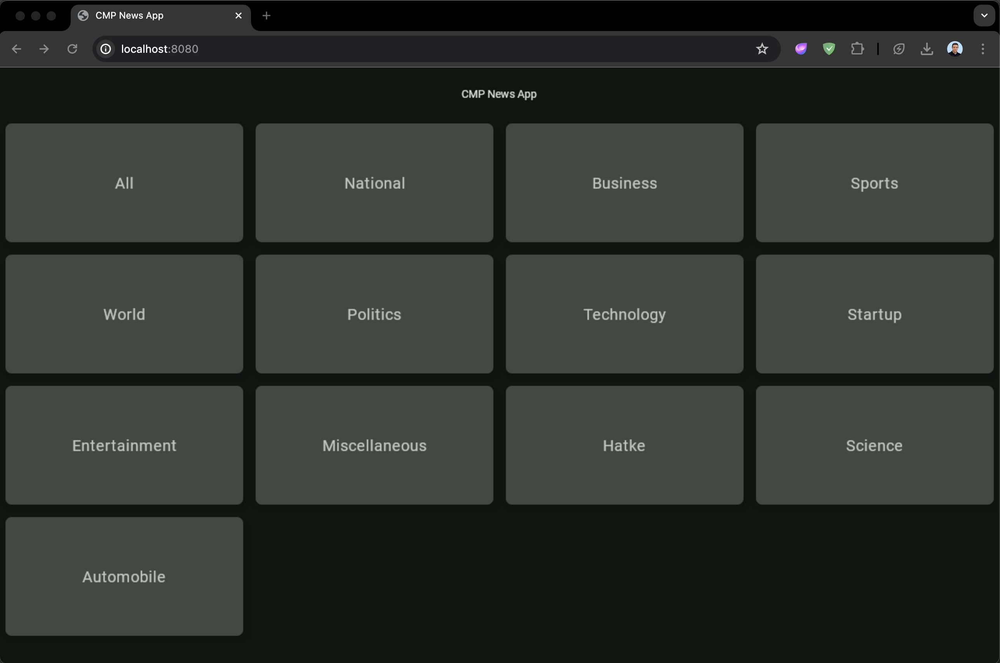
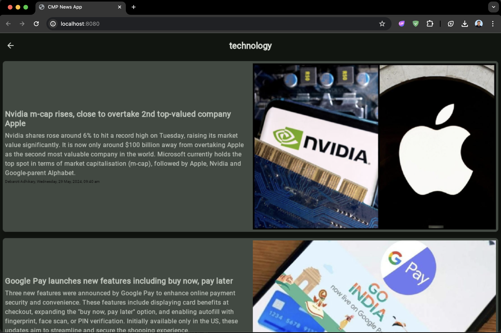

# KMP/CMP News App

### Project Description

This is a [Kotlin Multiplatform](https://www.jetbrains.com/help/kotlin-multiplatform-dev/get-started.html) project that uses 100% Compose UI and targeting
1. iOS
2. Android
3. Desktop
4. [Web (Wasm)](https://kotl.in/wasm)

`/composeApp` is for code that will be shared across your Compose Multiplatform applications.
  It contains several subfolders:
  - `commonMain` is for code that’s common for all targets.
  - Other folders are for Kotlin code that will be compiled for only the platform indicated in the folder name.
    For example, if you want to use Apple’s CoreCrypto for the iOS part of your Kotlin app,
    `iosMain` would be the right folder for such calls.

`/iosApp` contains iOS applications. Even if you’re sharing your UI with Compose Multiplatform, 
  you need this entry point for your iOS app. This is also where you should add SwiftUI code for your project.

### InShort API
[Unofficial InShorts News API](https://github.com/cyberboysumanjay/Inshorts-News-API) API was used to get
the news shown in the apps.

### Tech Stack:
- **[Kotlin](https://kotlinlang.org/)**: The primary programming language used for this project.
- **[Kotlin Multiplatform](https://www.jetbrains.com/help/kotlin-multiplatform-dev/get-started.html)**: for sharing code across platforms.
- **[Compose Multiplatform](https://github.com/JetBrains/compose-multiplatform/#compose-multiplatform)**: for UI
- **[Compose Navigation](https://www.jetbrains.com/help/kotlin-multiplatform-dev/compose-navigation-routing.html#sample-project)**: Navigation support for Compose.
- **[ViewModel](https://www.jetbrains.com/help/kotlin-multiplatform-dev/compose-viewmodel.html)**: for managing UI-related data in a lifecycle-conscious way.
- **[Ktor](https://ktor.io/)**: as API Client
- **[Koin](https://insert-koin.io/)**: for dependency injection.
- **[kotlinx.coroutines](https://github.com/Kotlin/kotlinx.coroutines)**: for managing asynchronous programming and coroutines in Kotlin.
- **[Coil](https://coil-kt.github.io/coil/)**: to load images from url.
- **[Ktlint](https://ktlint.github.io/)**: to format the code & enforce coding standards and style.
- and more...

# Screenshots

## Android

|                                   |                                   |
|:---------------------------------:|:---------------------------------:|
|  |  |

## iOS

|                               |                               |
|:-----------------------------:|:-----------------------------:|
|  |  |

## Desktop

|                                   |                                   |
|:---------------------------------:|:---------------------------------:|
|  |  |

## Web

|                               |                               |
|:-----------------------------:|:-----------------------------:|
|  |  |

## CONTACT

- [Linkedin](https://www.linkedin.com/in/muaz-kadan-727911107/)


You can open the web application by running the `:composeApp:wasmJsBrowserDevelopmentRun` Gradle task.


```xml
Designed and developed by Muaz KADAN

Licensed under the Apache License, Version 2.0 (the "License");
you may not use this file except in compliance with the License.
You may obtain a copy of the License at

   http://www.apache.org/licenses/LICENSE-2.0

Unless required by applicable law or agreed to in writing, software
distributed under the License is distributed on an "AS IS" BASIS,
WITHOUT WARRANTIES OR CONDITIONS OF ANY KIND, either express or implied.
See the License for the specific language governing permissions and
limitations under the License.